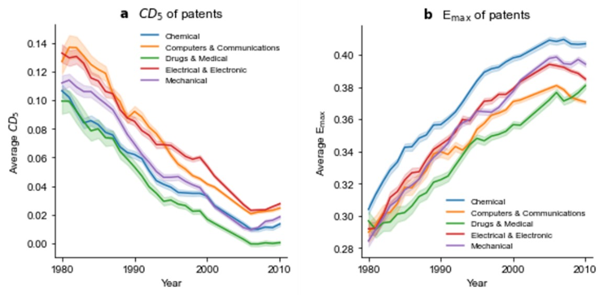
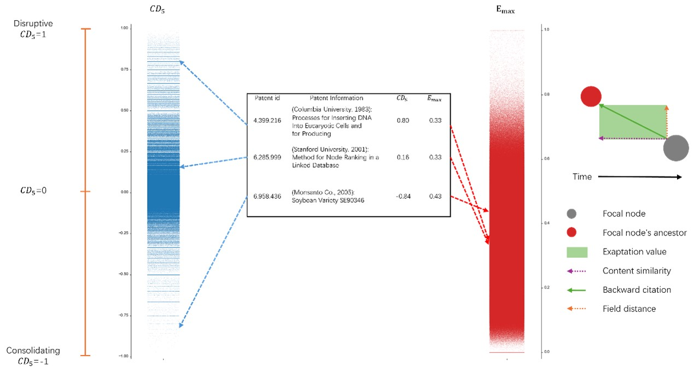

# Paper
Innovation beyond intention: harnessing exaptation for technological breakthroughs  
# Abstract
The frameworks that explore scientific and technological evolution suggest that discoveries and inventions are intrinsic processes, while the wealth of knowledge accumulated over time enables researchers to make further advancements, echoing Newton's sentiment of "standing on the shoulders of giants." Despite the exponential growth in new scientific and technical knowledge, the consolidation-disruption (D) index suggests a concerning decline in the disruptiveness of papers and patents. "Exaptation" a concept borrowed from biological evolution, is now recognized as a pivotal yet often neglected mechanism in technological evolution. Significant technologies often do not emerge out of thin air but rather result from the application of existing technologies in other domains. For instance, bird feathers initially served as waterproofing and insulation before enabling flight, and microwave ovens originated from radar magnetrons. Exaptation, acknowledged as the catalyst for "innovation beyond intention" signifies a cross-field evolutionary process that is driven by functional shifts in pre-existing knowledge, technology, or artifacts. In this study, we introduce the concept of exaptation value, deliberately excluding serendipity. Our analysis reveals that, despite a declining trend in the disruptiveness of innovation, there is an increasing trend in the application of cross-domain knowledge within the innovation process over time. We also explore the impact of technology exaptation on innovation disruptiveness and discuss how leveraging technology adaptability enhances innovation's disruptive potential.  

# Authors  
Youwei He, Jeong-Dong Lee, Seungmin Lee
# Citation  
He, Y., Lee, J. D., & Lee, S. (2024). Innovation beyond intention: harnessing exaptation for technological breakthroughs. arXiv preprint arXiv:2412.19662.
# Data
<a href='https://patentsview.org/'>USPTO</a>   
# Download
<a href='https://doi.org/10.48550/arXiv.2412.19662'>V1</a>  
V2
# Conference (2024 International Conference on the Science of Science and Innovation)  
<a href='doc/abstract.pdf'>Abstract</a>  
<a href='doc/HeYouwei_July2.pdf'>Presentation</a>  
## Other content (including codes) will be uploaded later.
